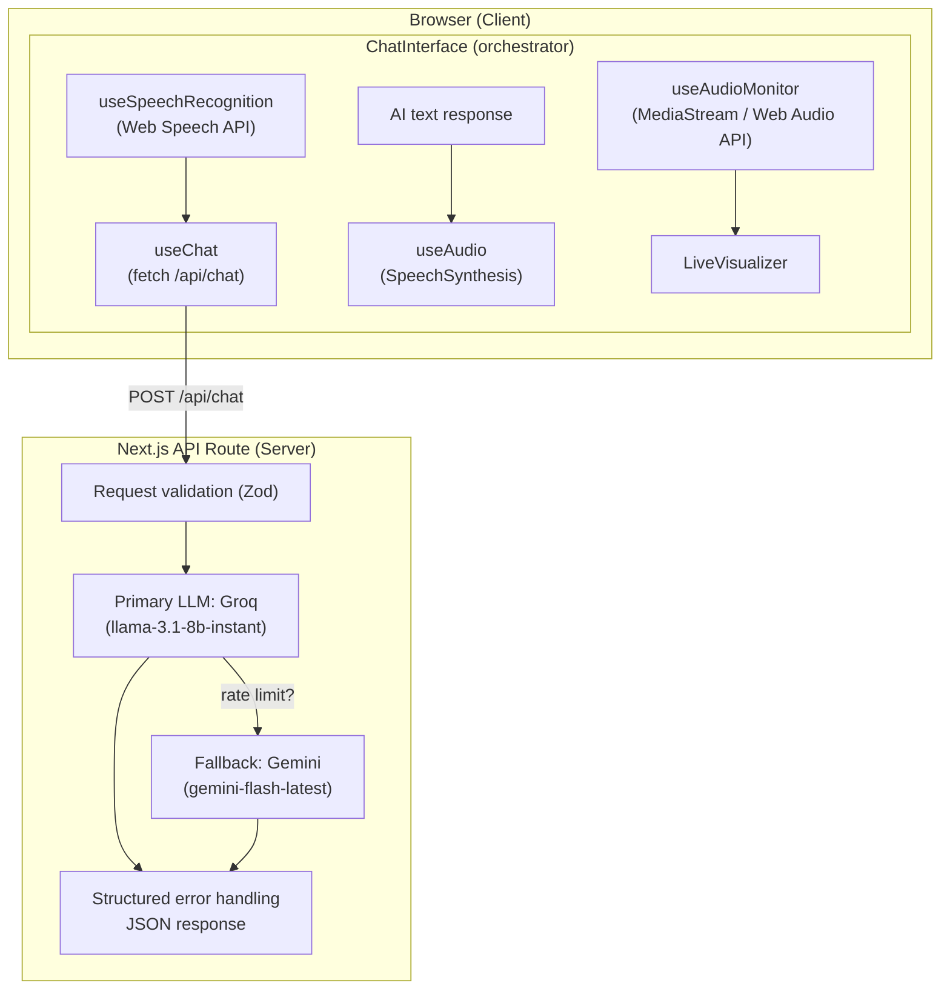
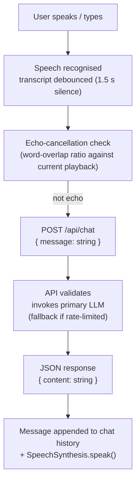
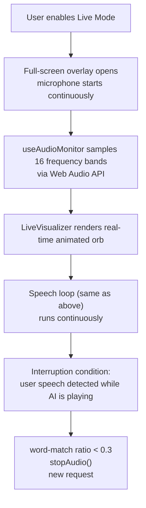

# SMT.AI — Voice Agent

A production-grade, voice-enabled AI assistant built with Next.js 15. Users can hold full natural-language conversations with the system using only their voice: speech is transcribed in real time, sent to a multi-provider LLM backend, and the response is played back via browser speech synthesis. A dedicated **Live Mode** provides an immersive, full-screen call experience with real-time audio visualisation and automatic echo cancellation.

---

## Features

- **Voice-first interaction** — speak naturally; no typing required
- **Live Mode** — full-screen immersive call interface with animated audio visualiser
- **Real-time speech recognition** — powered by the browser Web Speech API
- **Text-to-speech playback** — AI responses read aloud using browser SpeechSynthesis
- **Interruptible responses** — the AI stops speaking the moment the user starts talking
- **Echo cancellation** — word-level matching prevents the microphone from picking up the AI's own audio and feeding it back as user input
- **Multi-provider LLM backend** — Groq (primary) with automatic rate-limit fallback to Google Gemini
- **Type-safe API layer** — Zod-validated request schema, structured error handling
- **Responsive UI** — works across desktop and mobile Chrome/Safari

---

## Tech Stack

| Layer | Technology |
|---|---|
| Framework | Next.js 15 (App Router) |
| Language | TypeScript 5 |
| Styling | Tailwind CSS 4 |
| UI Components | Radix UI primitives + shadcn/ui |
| Animations | Framer Motion |
| AI / LLM | Google Gemini (`gemini-flash-latest`) · Groq (`llama-3.3-70b-versatile`) |
| LLM Orchestration | LangChain (`@langchain/core`, `@langchain/groq`, `@langchain/google-genai`) |
| Speech Recognition | Web Speech API via `react-speech-recognition` |
| Speech Synthesis | Browser `SpeechSynthesis` API |
| Input Validation | Zod |
| State Management | React hooks (no external store needed at this scale) |

---

## System Architecture



---

## Project Workflow

### Standard (text or voice) conversation



### Live Mode



---

## Installation

### Prerequisites

- Node.js 18 or later
- A Google Gemini API key **or** a Groq API key (both is recommended for fallback)

### Steps

```bash
# 1. Clone the repository
git clone <repository-url>
cd AI-voice-chat

# 2. Install dependencies
npm install

# 3. Configure environment variables
cp .env.example .env.local
# Edit .env.local and add your API keys

# 4. Start the development server
npm run dev
```

Open [http://localhost:3000](http://localhost:3000) in Chrome or Safari (required for Web Speech API support).

---

## Environment Variables

| Variable | Required | Description |
|---|---|---|
| `GOOGLE_API_KEY` | One of the two | Google Gemini API key. Acts as the fallback LLM. |
| `GROQ_API_KEY` | One of the two | Groq API key. Acts as the primary LLM. |

At least one key must be set. When both are present, Groq is used as primary and Gemini is the automatic rate-limit fallback.

Obtain keys from:
- Google Gemini: https://aistudio.google.com/app/apikey
- Groq: https://console.groq.com/keys

---

## Available Scripts

| Script | Description |
|---|---|
| `npm run dev` | Start development server with hot reload |
| `npm run build` | Compile and optimise for production |
| `npm run start` | Run the compiled production server |
| `npm run lint` | Run ESLint across the codebase |

---

## Third-Party Services

| Service | Purpose |
|---|---|
| **Google Gemini** (`gemini-flash-latest`) | Fallback LLM for AI responses |
| **Groq** (`llama-3.3-70b-versatile` / `llama-3.1-8b-instant`) | Primary LLM for AI responses |
| **Web Speech API** | Browser-native speech recognition (Chrome / Safari) |
| **SpeechSynthesis API** | Browser-native text-to-speech playback |
| **Web Audio API** | Microphone frequency analysis for the live visualiser |

No external database, authentication service, or cloud storage is required.

---

## Deployment

### Vercel (recommended)

```bash
npm run build   # verify the build passes locally first
```

Then connect the repository to Vercel and add `GOOGLE_API_KEY` and `GROQ_API_KEY` as environment variables in the project settings.

### Any Node.js host (VPS, Railway, Render, etc.)

```bash
npm run build
npm run start   # listens on PORT env var or 3000 by default
```

Set the environment variables on the host before starting.

---

## Security Notes

- API keys are read exclusively from server-side environment variables — they are never exposed to the client bundle.
- The `/api/chat` route validates all incoming payloads with Zod before any LLM call.
- `.env` and `.env.local` are listed in `.gitignore` and will not be committed.
- `package-lock.json` is excluded from version control to avoid lock-file bloat in generated deployments; regenerate with `npm install` after cloning.

---

## Browser Compatibility

The Web Speech API (recognition and synthesis) is supported in:

| Browser | Support |
|---|---|
| Google Chrome | Full |
| Microsoft Edge | Full |
| Safari (macOS / iOS) | Full |
| Firefox | Limited / not supported |

---

## Screenshots

> Add project screenshots here.

---

## License

Proprietary — SMT.AI. All rights reserved.
